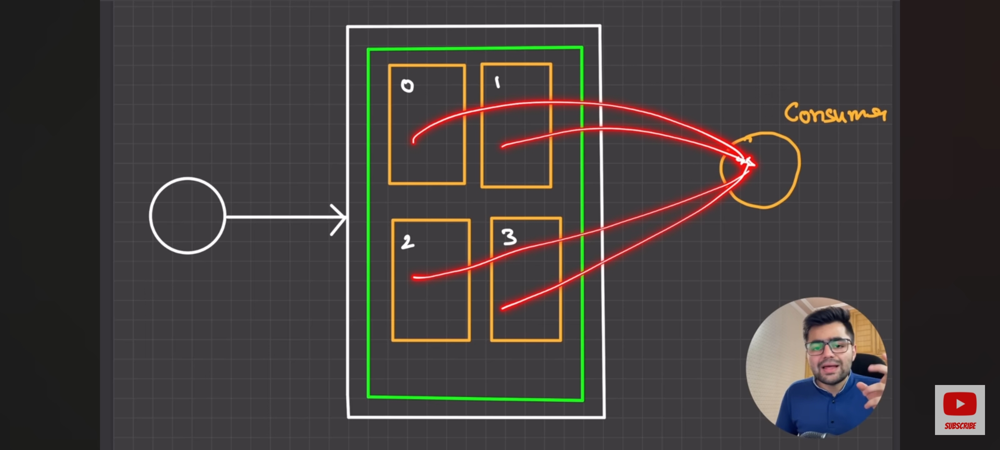
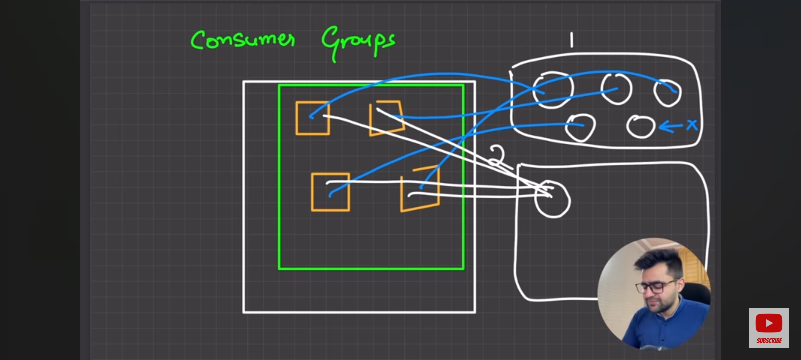

- throughput -> the amount of material or items passing through a system or process

##USE CASES

- zomato -> live location updates
  solution: each second, current location sent to zm-server, and from server to db and client
  problem: too much data to handle, ops(operation per second) too high, db throughput i.e. ops is very low
- discord -> chats are recieved at server, server stores in db as well as sends to client
  problem: too high ops, can't achieve real time
- ola, uber -> real time driver location updates, fare calculations, etc.

## KAFKA

- kafka has high throughput, high ops, kafka ke andar millions of records insert krna, nikalna is easy as compared to db
- storage of kafka is temporary and can't hold data for long
- db queries on kafka is not possible

(hence db is also necessary, and kafka is no alternative to db)

## Architecture

eg1 : user's live location data (producer) -> fed to kafka -> {fare, analysis, customer update} (consumers) -> bulk insertion to database

eg2 : zomato's delivery partner (producer) -> data to kafka -> {analysis, customer update} (consumer) -> db bulk update

## Kafka's internal stuff

producer -> kafka -> consumer

- topic -> a logical channel that organizes and stores streams of events, eg: rider updates one topic, restaurant updates another topic

- producer -> produces data to different topics,

[Problem - Lots of incoming messages on a topic can clutter a topic, so, just like db partitioning, we create partitions, now, basis of data division depends upon us like let's say location, name,etc.]

Different partitions can have different consumers

(db partitioning -> data is partitioned into multiple dbs)

## Technicials

### Partitions:

Partitions are distinguished on the basis of indexing like 0,1,2,etc.

Understanding with example:

eg1:

Let's say we have one producer, one topic, 4 partitions and one consumer

every partition will then be consumed by just one consumer, if another consumer is added, the partition blocks are divided equally, but, the partitions do not get divided further, that means, the

**maximum number of consumers on a topic = no. of partitions in the topic**

but what if 5th consumer is added, it stays idle

**one consumer can consume multiple partitions**
**multiple consumers cannot consume single partition**

### Consumer Groups:

every consumer that gets created is added to a consumer group, now, if there are 4 partitions, and we have 5 consumers all in one consumer group, the 5th one stays idle,
but, if we create another consumer group and add one consumer in there, according to self balancing, that consumer will be able to consume messages from all 4 partitions

**self balancing is only at group level**

### DS of kafka:

1. Pub/Sub:

   one publisher, multiple subscribers

2. Queue:

   FIFO

if no. of partitions === no. of consumers and no. of consumer groups === 1 => kafka acts as a queue architecture

in any other case, it acts as a pub/sub architecture

### Hands On

kafka uses zookeeper internally for maintaining a list of kafka topics and messages, to create replicas, consumer groups, balancing, etc.

<mark>STEP-1: Running zookeeper service</mark>

> docker run --name zookeeper -p 2181:2181 -d zookeeper

<mark>STEP-2: Running kafka</mark>

> docker run -p 9092:9092 \
> -e KAFKA_ZOOKEEPER_CONNECT='PRIVATE_IP':2181 \
> -e KAFKA_ADVERTISED_LISTENERS=PLAINTEXT://<PRIVATE_IP>:9092 \
> -e KAFKA_OFFSETS_TOPIC_REPLICATION_FACTOR=1 \
> confluentinc/cp-kafka

-e basically I think sets the environment variable, KAFKA_ZOOKEEPER_CONNECT is for my-ip:port of zookeeper, KAFKA_ADVERTISED_LISTENERS tells which port kafka is running on, PLAINTEXT is the protocol

KAFKA_OFFSETS_TOPIC_REPLICATION_FACTOR: tbd (to be discussed), 1 tells no replication

confluentinc/cp-kafka -> name of the kafka image

ADMIN does the infra setup like topics creation, partitions creation

kafka application is also called broker

<mark>STEP-3: Running a program where an admin configures the topic and the partitions, and a producer and a consumer</mark>

Refer the code, now, in that, if we increase the consumers, the same logic can be seen, one consumer consumes messages of both partitions, if we add another, self balancing happens and one consumer listens to one partition and other to other, if we add another consumer, consumer 3 remains empty

The logic of if we add a consumer to another group can also be verified by the code above, it starts consuming messages from both the partitions
